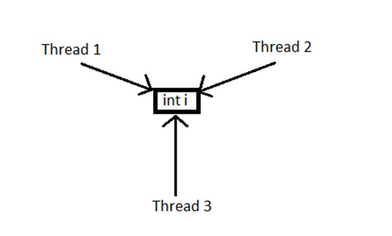

# Threads in Java

- Threads can be used to perform complicated tasks in the background without interrupting the main program. Threads allow to do multiple things at the same time.
- Threads are required to run some task in background while original flow of program is not broken. 

- There are two ways to create a thread-

## a) It can be created by extending the Thread class and overriding its run() method:
```java
 public class MyClass extends Thread {
            public void run() {
               System.out.println("This code is running in a thread");
            }
          }
```

## b) Another way to create a thread is to implement the Runnable interface:
```java
 public class MyClass implements Runnable {
          public void run() {
               System.out.println("This code is running in a thread");
          }
       }
```
 
## Starting threads
- a) If the class extends the Thread class, the thread can be run by creating an instance of the class and call its start() method:

```java
public class MyClass extends Thread {
  public static void main(String[] args) {
    MyClass thread = new MyClass();
    thread.start();
    System.out.println("This code is outside of the thread");
  }
  public void run() {
    System.out.println("This code is running in a thread");
  }
}
```
```text
Output-
This code is outside of the thread
This code is running in a thread
```

 
- b) If the class implements the Runnable interface, the thread can be run by passing an instance of the class to a Thread object's constructor and then calling the thread's start() method:
```java
public class MyClass implements Runnable {
  public static void main(String[] args) {
    MyClass obj = new MyClass();
    Thread thread = new Thread(obj);
    thread.start();
    System.out.println("This code is outside of the thread");
  }
  public void run() {
    System.out.println("This code is running in a thread");
  }
}

```

```text
Output-  
This code is outside of the thread  
This code is running in a thread
```

## Differences between "extending" and "implementing" Threads

-The major difference is that when a class extends the Thread class, you cannot extend any other class, but by implementing the Runnable interface, it is possible to extend from another class as well, like: class MyClass extends OtherClass implements Runnable.


## Concurrency problem with threads and Synchronized keyword
 
- When more than one thread tries to access same resource (variable/object or method) at sametime (concurrently), then concurrency problem arises and you might get wrong output. 
- This problem is solved by synchronized keyword. **Synchronized allows only one thread to access the resource at single point of time.** 
- a **synchronized** keyword can be used with variables/objects as well as methods.



Syntax-  
```
synchronized(objectidentifier) {
   
}
```

- The output of the above program without synchronized resources cannot be predicted and can change everytime program is executed.
- This problem is solved by using synchronized keyword as show below- Multithreading WITH synchronized.

Synchronized variable-

```java
class ThreadDemo extends Thread {
   private Thread t;
   private String threadName;
   PrintDemo  PD;

   ThreadDemo( String name,  PrintDemo pd) {
      threadName = name;
      PD = pd;
   }
   
   public void run() {
      synchronized(PD) {
         PD.printCount();
      }
      System.out.println("Thread " +  threadName + " exiting.");
   }
   }
```
   
The program using syncronized produces same output each time the program is executed.

## Using syncronized keyword with methods-
```java
class Cars  
{ 
    public synchronized void startHonking() 
    { 
        System.out.println("Starting honking.....\t"); 
        try 
        { 
            Thread.sleep(1000); 
        }  
        catch (Exception e)  
        { 
            System.out.println("Thread interrupted."); 
        } 
        System.out.println("\n Peep Peep"); 
    } 
} 
```

## Using syncronized keyword with blocks

-Instead of synchronizing whole method, you can synchronize only part of the program using synchronized blocks as follows-

```java
class Cars 
{ 
    public void startHonking() 
    { 
        synchronized(this) 
        { 
            System.out.println("Starting Honking....."); 
            try 
            { 
                Thread.sleep(1000); 
            }  
            catch (Exception e)  
            { 
                System.out.println("Thread interrupted."); 
            } 
            System.out.println("\nPeep Peep"); 
        } 
    } 
} 
```


           