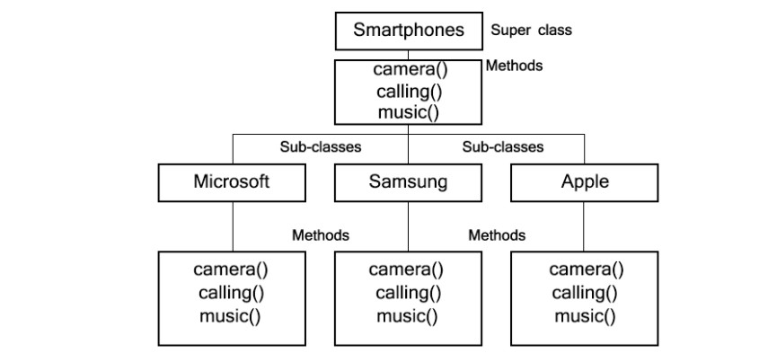

# Polymorphism
  
- it just means many shapes 




## Polymorphism are of two types: 

1. Compile-time Polymorphism ( Static Polymorphism) - Here method overloading happens , same method with different parameters and types are present. 

2. Run-time Polymorphism - Here JVM calls method at runtime. Method Overriding happens in this case. 

**Example of Compile Type Polymorphism:**

```java
class Sample{
		
	public void disp(int x, int y){
		System.out.println("Value of x : " + x);
		System.out.println("Value of y : " + y);
	}
	public void disp(int x){
		System.out.println("Value of x : " + x);
	}	
	public static void main(String[] args){
	
	Sample s = new Sample();
	s.disp(5, 6);
	s.disp(7);
	}
}

```
```
Output:
Value of x : 5
Value of y : 6
Value of x : 7
```
**Example of Runtime Type Polymorphism:**

```java
class A
{
    void disp(){
		
        System.out.println ("class A");
    }
}

class B extends A
{
    void disp(){
		
        System.out.println ("Class B");
    }
}
class C{
	
	public static void main (String args []) {
	A obj1 = new A();
	obj1.disp();
	   
	A obj2 = new B();
	obj2.disp();
	}
}
```
```
Output:
Class A
Class B
```

[2.4.1_Runtime_Polymorphism_exaplined.md](2.4.1_Runtime_Polymorphism_exaplined.md)
  


