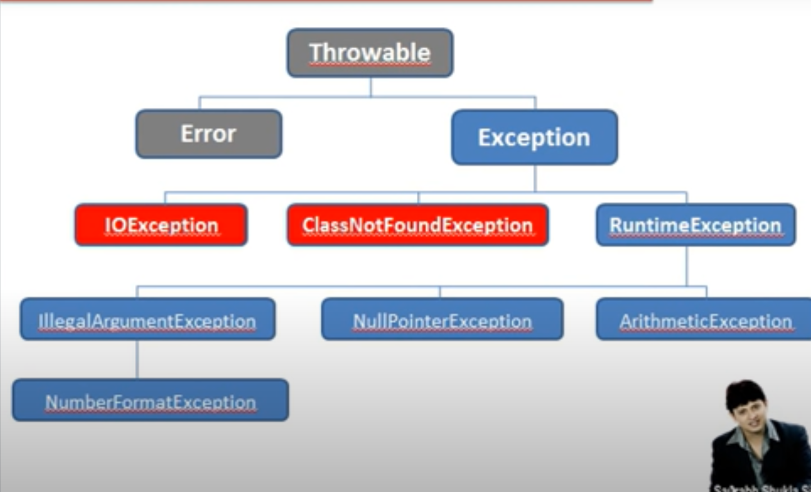
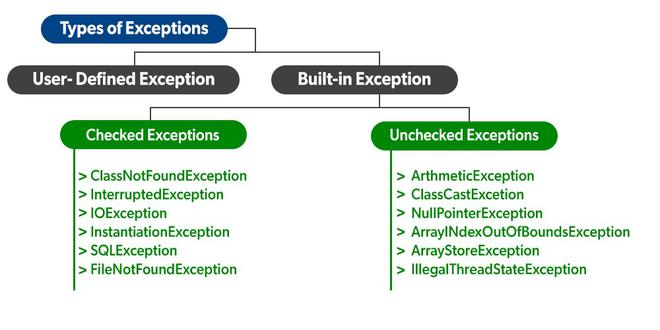

# Exception handling in java

- Exception Handling in Java is one of the effective means to handle the runtime errors so that the regular flow of the application can be preserved.
- Java Exception Handling is a mechanism to handle runtime errors such as ClassNotFoundException, IOException, SQLException, RemoteException, etc.

##  **default throw/catch mechanism:**   

- Whenever inside a method, if an exception has occurred, the method creates an Object known as Exception Object and hands it off to the run-time system(JVM)
- he exception object contains the name and description of the exception and the current state of the program where the exception has occurred
- Creating the Exception Object and handling it to the run-time system is called throwing an Exception
- There might be a list of the methods that had been called to get to the method where an exception occurred. This ordered list of the methods is called Call Stack
 
- The run-time system searches the call stack to find the method that contains a block of code that can handle the occurred exception. The block of the code is called an Exception handler.
- The run-time system starts searching from the method in which the exception occurred, proceeds through the call stack in the reverse order in which methods were called.
- If it finds an appropriate handler then it passes the occurred exception to it. Appropriate handler means the type of the exception object thrown matches the type of the exception object it can handle.
- If the run-time system searches all the methods on the call stack and couldn’t have found the appropriate handler then the run-time system handover the Exception Object to the default exception handler, which is part of the run-time system. This handler prints the exception information in the following format and terminates the program abnormally.

## An exception can occur for many reasons. Some of them are:

- Invalid user input
- Device failure
- Loss of network connection
- Physical limitations (out of disk memory)
- Code errors
- Opening an unavailable file

## What is an Error?
- Errors represent irrecoverable conditions such as Java virtual machine (JVM) running out of memory, memory leaks, stack overflow errors, library incompatibility, infinite recursion, etc.

- Errors are usually beyond the control of the programmer and we should not try to handle errors.

## Exception Hierarchy

- All exception and errors types are subclasses of class Throwable, which is the base class of the hierarchy. One branch is headed by Exception. This class is used for exceptional conditions that user programs should catch.

## Types of Exceptions

- Exceptions can be Categorized into 2 Ways:
  - Built-in Exceptions
  - Checked Exception
  - Unchecked Exception

- **User-Defined Exceptions**

- **1. Built-in Exceptions**: Built-in exceptions are the exceptions that are available in Java libraries. These exceptions are suitable to explain certain error situations.

  - **Checked Exceptions:** 
    - Checked exceptions are called **compile-time exceptions** because these exceptions are checked at compile-time by the compiler.
    - These are the exceptions that are checked at compile time. If some code within a method throws a checked exception, then the method must either handle the exception or it must specify the exception using the **throws** keyword.
    
  - **Unchecked Exceptions**: 
    - The unchecked exceptions are just opposite to the checked exceptions. 
    - The compiler will not check these exceptions at compile time. 
    - In simple words, if a program throws an unchecked exception, and even if we didn’t handle or declare it, the program would not give a compilation error
 
[examples exceptions](https://github.com/njain51/orangutan/tree/main/src/main/java/examples/corejava/example_exceptions)

- **In  total four options are possible:** 
  - default throw and default catch 
  - default throw and our catch
  - our throw and default catch
  - our throw and our catch 

[Read further on try catch](3.1.1_try_catch.md)

    
    
   
   
