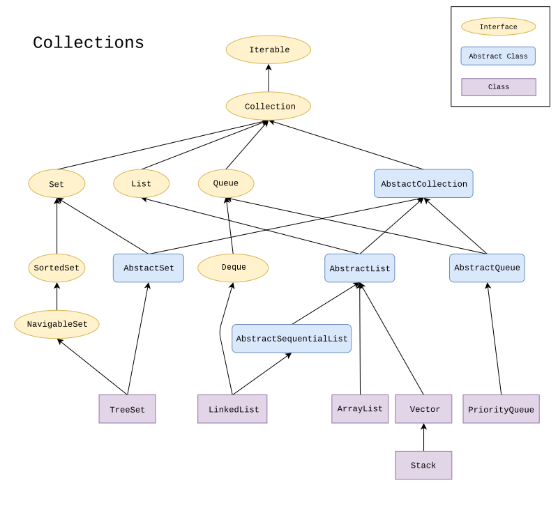
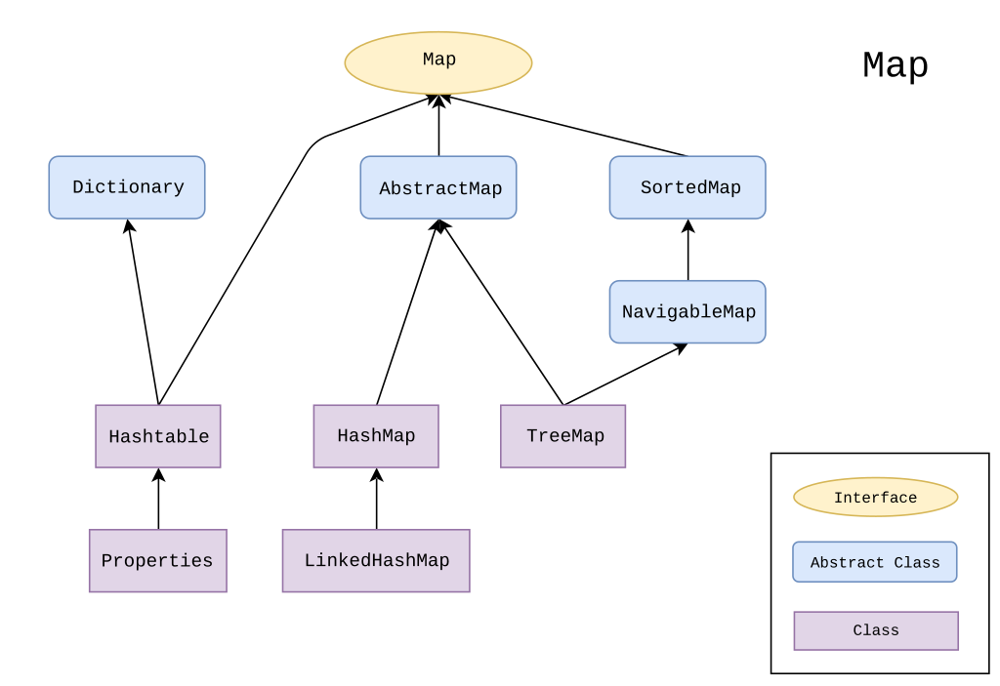

Refer Diagram here:  

 

- **Collection is an Interface. Its part of java.util package.**

- **Collection(I) is further classified to List(I), Queue(I) and SET(I)**

- Concerte Clases for List(I): ArrayList; LinkedList, Stack, Vector etc.  

- Concrete Classes for Queue(I): Priority Queue etc  

- Concrete Classes for Set(I) are: HashSet, LinkedHashSet;  

- Set(I) further have another child Interface called - SortedSet(I) - this have concrete class called TreeSet.

- Another Separate Interface which is also part of java.util but which is not child of Colleciton(I) is Map(I).

- Concrete Class for Map(I): HashMap, LinkedHashMap etc. 

- Map(I) has another child Interface : SortedMap(I)

- Concrete Calss for SortedMap(I): TreeMap etc. 

**Then we have other Interfaces:**

- Iterator(I)

- List Iterator(I)

- Enumeration(I)

- Comparator(I)

- Comparable(I)

