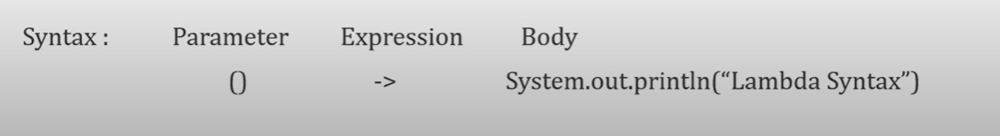

# lambda function

- Lambda Expressions were added in Java 8. 

- The Expression through which we can represent an Anonymous function
- Anonymous: Nameless / Unknown
- Anonymous Fuinction - **A method which don't have any name or modifier**
- So, Lambda expressions are similar to methods, but they do not need a name.



- The simplest lambda expression contains a single parameter and an expression:

```text
parameter -> expression
```

-  To use more than one parameter, wrap them in parentheses:
```text
(parameter1, parameter2) -> expression
```   

- In order to do more complex operations, a code block can be used with curly braces. If the lambda expression needs to return a value, then the code block should have a return statement.
```text
(parameter1, parameter2) -> { code block }
```

### Lambda is only applicable for Functional Interface

```java
package com.examples.lambda;

public class App1 {

    public static void m1(){
        //Normal method:
        System.out.println("Normal Function");
    }


    // Anonymous function
//    () {
//        System.out.println("Anonymous Function");
//    }

    public static void main(String[] args) {

        // we can call Normal method as follows:
      new App1().m1();

    }
}

```

- we cannot call Anonymous function.
- so for every method we cannot write Lambda function
- Lambda is only applicable for Functional Interface
- so for the method which are present in Functional Interface we can write lambda expression for it. 

### What is Functional Interface

- The interface which contains only one abstract method but can have multiple default and static method is called **functional interface.** 

Example: 

```text

Runnable ----------------> run()
Callable ----------------> call()
Comparable ----------------> compareTo()
Comparator ----------------> compare()

```

- example for Runnable
```java
/*
 * Copyright (c) 1994, 2013, Oracle and/or its affiliates. All rights reserved.
 * ORACLE PROPRIETARY/CONFIDENTIAL. Use is subject to license terms.
 *
 *
 *
 *
 *
 *
 *
 *
 *
 *
 *
 *
 *
 *
 *
 *
 *
 *
 *
 *
 */

package java.lang;

/**
 * The <code>Runnable</code> interface should be implemented by any
 * class whose instances are intended to be executed by a thread. The
 * class must define a method of no arguments called <code>run</code>.
 * <p>
 * This interface is designed to provide a common protocol for objects that
 * wish to execute code while they are active. For example,
 * <code>Runnable</code> is implemented by class <code>Thread</code>.
 * Being active simply means that a thread has been started and has not
 * yet been stopped.
 * <p>
 * In addition, <code>Runnable</code> provides the means for a class to be
 * active while not subclassing <code>Thread</code>. A class that implements
 * <code>Runnable</code> can run without subclassing <code>Thread</code>
 * by instantiating a <code>Thread</code> instance and passing itself in
 * as the target.  In most cases, the <code>Runnable</code> interface should
 * be used if you are only planning to override the <code>run()</code>
 * method and no other <code>Thread</code> methods.
 * This is important because classes should not be subclassed
 * unless the programmer intends on modifying or enhancing the fundamental
 * behavior of the class.
 *
 * @author  Arthur van Hoff
 * @see     java.lang.Thread
 * @see     java.util.concurrent.Callable
 * @since   1.0
 */
@FunctionalInterface
public interface Runnable {
    /**
     * When an object implementing interface <code>Runnable</code> is used
     * to create a thread, starting the thread causes the object's
     * <code>run</code> method to be called in that separately executing
     * thread.
     * <p>
     * The general contract of the method <code>run</code> is that it may
     * take any action whatsoever.
     *
     * @see     java.lang.Thread#run()
     */
    public abstract void run();
}

```

- Similarly, we can write our own Functional Interface

```java
package com.examples.lambda;

@FunctionalInterface
public interface App1 {

    void m1();

    default void m2(){
        System.out.println("Default method 1");
    }

    default void m3(){
        System.out.println("Default method 2");
    }
    
    static void m4() {
        System.out.println("Static method 1");
    }
    
}

```

- we cannot have more than one Abstract method as it will throw error due to @FunctionalInterface used


- Lets write lambda expression for our own functional Interface: 

```java
package com.examples.lambda;

@FunctionalInterface
interface Calculator {

    void SwitchOn();
}

public class CalculatorImpl {


    public static void main(String[] args) {

        Calculator calc1 = new Calculator() {
            @Override
            public void SwitchOn() {
                System.out.println("Without Lambda Expression using Anonymous Class");

            }
        };
        calc1.SwitchOn();


        // Following is lambda expression implementation of above Functional Interface
        Calculator calc = () -> {

            System.out.println("Switch on with  Lambda Expression");
            //  ()   ->   {body};
        };

        calc.SwitchOn();


    }
}


```
- Note we don't need to implement interface explicitly when implementing interface method. we can do it via anonymous class
- Further with Lambda expression we are reducing that syntax too. 


### Java Lambda Expression Example: No Parameter

```java
interface Sayable{  
    public String say();  
}  
public class LambdaExpressionExample3{  
public static void main(String[] args) {  
    Sayable s=()->{  
        return "I have nothing to say.";  
    };  
    System.out.println(s.say());  
}  
}  
```
Output:
```text
I have nothing to say.
```

### Java Lambda Expression Example: Single Parameter

```java
interface Sayable{  
    public String say(String name);  
}  
  
public class LambdaExpressionExample4{  
    public static void main(String[] args) {  
      
        // Lambda expression with single parameter.  
        Sayable s1=(name)->{  
            return "Hello, "+name;  
        };  
        System.out.println(s1.say("Sonoo"));  
          
        // You can omit function parentheses    
        Sayable s2= name ->{  
            return "Hello, "+name;  
        };  
        System.out.println(s2.say("Sonoo"));  
    }  
}  
```

Output:
```text
Hello, Sonoo
Hello, Sonoo
```
### Java Lambda Expression Example: Multiple Parameters

```java
interface Addable{  
    int add(int a,int b);  
}  
  
public class LambdaExpressionExample5{  
    public static void main(String[] args) {  
          
        // Multiple parameters in lambda expression  
        Addable ad1=(a,b)->(a+b);  
        System.out.println(ad1.add(10,20));  
          
        // Multiple parameters with data type in lambda expression  
        Addable ad2=(int a,int b)->(a+b);  
        System.out.println(ad2.add(100,200));  
    }  
}  
```

Output:
```text
30
300
```

### Java Lambda Expression Example: with or without return keyword

- In Java lambda expression, if there is only one statement, you may or may not use return keyword. You must use return keyword when lambda expression contains multiple statements.

```java
interface Addable{  
    int add(int a,int b);  
}  
  
public class LambdaExpressionExample6 {  
    public static void main(String[] args) {  
          
        // Lambda expression without return keyword.  
        Addable ad1=(a,b)->(a+b);  
        System.out.println(ad1.add(10,20));  
          
        // Lambda expression with return keyword.    
        Addable ad2=(int a,int b)->{  
                            return (a+b);   
                            };  
        System.out.println(ad2.add(100,200));  
    }  
}  
```

Output:
```text
30
300
```

```java
package com.examples.lambda;

@FunctionalInterface
interface Calculator {

    int add(int a,int b);
}

public class CalculatorImpl {


    public static void main(String[] args) {

        Calculator addition = new Calculator() {
            @Override
            public int add(int a, int b) {
                System.out.println("Without Lambda Expression using Anonymous Class");
                return a+ b;

            }
        };
        System.out.println(addition.add(20,30));


        // Following is lambda expression implementation of above Functional Interface
        Calculator calc = (x,y) -> { return (x+y);

        };
        System.out.println("With Lambda Expression Sum is " + calc.add(30,70));
        //  ()   ->   {body};


    }
}

```
Output:
```text
Without Lambda Expression using Anonymous Class
50
With Lambda Expression Sum is 100
```

### Java Lambda Expresssion Example: Parameter with Business Logic:

```java
package com.examples.lambda;

@FunctionalInterface
interface Calculator {

    int subtract(int a, int b);
}

public class CalculatorImpl {


    public static void main(String[] args) {


        // Normal method implementation using anonymous class
        Calculator addition = new Calculator() {
            @Override
            public int subtract(int a, int b) {
                System.out.println("Without Lambda Expression using Anonymous Class");
                return b - a;

            }
        };
        System.out.println(addition.subtract(20, 30));

        // Following is lambda expression implementation of above Functional Interface

        Calculator calc = (x, y) -> (y - x);

        System.out.println("With Lambda Expression Sum is " + calc.subtract(30, 70));


        // Lambda expression with Businees logic

        Calculator c = (x, y) -> {
            if (x > y) {
                throw new RuntimeException("X should be less than y");
            } else return y - x;
        };

        System.out.println("With Lambda expression and business logic" + c.subtract(30,20)); // this will throw exception
    }
}

```
Output: 
```text
Without Lambda Expression using Anonymous Class
10
With Lambda Expression Sum is 40
Exception in thread "main" java.lang.RuntimeException: X should be less than y
	at com.examples.lambda.CalculatorImpl.lambda$main$1(CalculatorImpl.java:37)
	at com.examples.lambda.CalculatorImpl.main(CalculatorImpl.java:41)
```


### Java Lambda Expression Example: Foreach Loop

```java
package com.examples.lambda;

import java.util.ArrayList;
import java.util.Iterator;

public class App {


    public static void main(String[] args) {
        ArrayList<Integer> alist = new ArrayList<>();

        alist.add(5);
        alist.add(6);
        alist.add(11);
        alist.add(16);
        alist.add(18);
        alist.add(-3);
        alist.add(-10);

        // Normal Print
        Iterator i = alist.iterator();
        System.out.println("normal print");
        while ((i.hasNext())){
            System.out.println(i.next());
        }

        // Using Lambda expression
        System.out.println("Using Lambda Expression");
        alist.forEach( (n) -> { System.out.println(n)   ; } );

    }
}

```

### Lambda expressions and normal method arguments-

- Assign a lambda expression to a variable of Functional interface (interface having only one abstract method declaration). Then you can pass that variable as an argument to some other method. Inside that method, that variable will be treated as an object of an anonymous class of which implements that interface.

```java
package com.examples.lambda;

interface ABC
{
    void display(String str);
}
class XYZ
{
    public static void main(String args[])
    {
        ABC i=(n)->{System.out.println(n);};
        ABC i1=(n)->{System.out.println(n+100);};
        i.display("Hello");
        i1.display("Hello");
    }
    void show(ABC x)
    {
        x.display("Hello");
        x.display("Hello" +100);
    }
}

```

```text
Hello
Hello100

```


